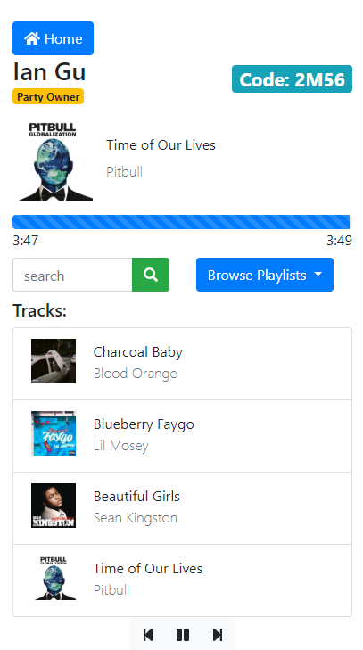

# Spo2fi - queue with friends
Demo here: https://spo2fi.herokuapp.com/

What does it do? Spo2fi allows people to queue songs to one device. Good for hangouts, office parties, long car rides, short car rides, etc..

---

### SETUP:
##### Environment variables to set before running:
- `SPOTIFY_CLIENT_ID`
- `SPOTIFY_CLIENT_SECRET`
- `SESSION_SECRET_KEY` (random string of characters for Flask.session)
- `REDIRECT_URI` (redirect callback for spotify web api)

---

### From the author:
The inspiration for this project came from the many different music bot implementations for a popular VOIP program known as Discord, as well as my friends bickering about what songs to play in the car. 

### backlog:
- [ ] rename the project (it's not supposed to resemble the name spotify)
- [x] add player controls (prev, next, pause, resume)
- [ ] fill playlist when end is reached (this will be hard to do)
- [x] allow users to browse / add songs from their other playlists
- [x] flash message errors
- [ ] find better solution than keeping everything in memory (redis integration)
- [ ] find elegant solution to deleting old sessions
- [ ] migrate to a pure backend/frontend solution (very distant future)
